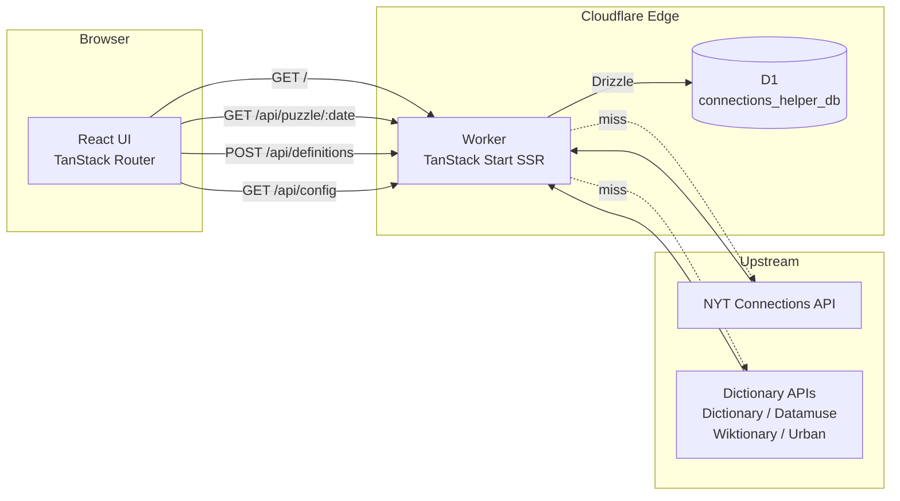
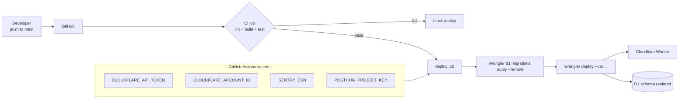
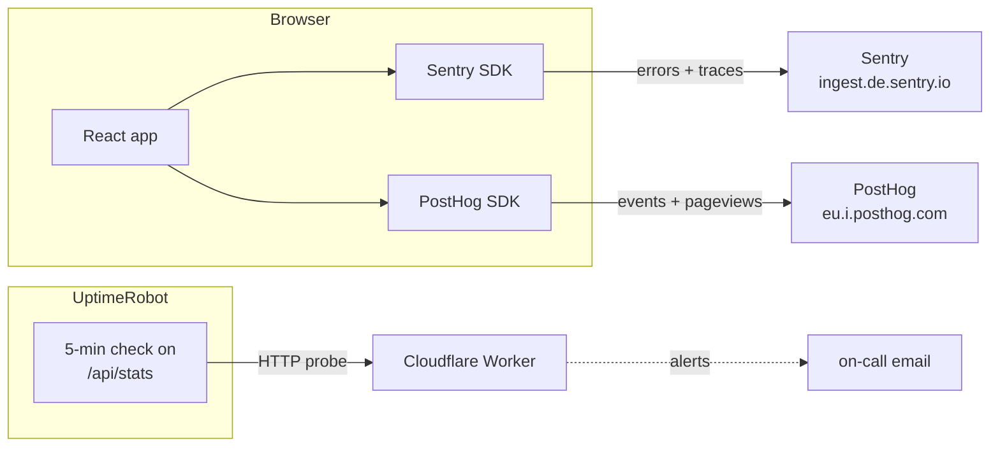

# Architecture

High-level view of how the pieces fit together. Diagrams use Mermaid; GitHub renders them natively.

## Request path

The app is a single Cloudflare Worker that both serves the SSR-rendered React UI and hosts the API. D1 acts as a cache so repeat puzzle/definition lookups never hit the upstream APIs.



**Cache semantics**

- `puzzles` table: keyed by `YYYY-MM-DD`. Cache-forever (NYT puzzles are immutable once published).
- `definitions` table: keyed by `word`. 30-day TTL on the endpoint (`fetchedAt` column drives expiry).
- Client never talks to NYT or dictionary APIs directly; the Worker is the only egress point.

## Runtime config flow

Observability keys (Sentry DSN, PostHog key) are not compiled into the bundle. They live as Cloudflare Worker `vars`, are exposed via a small server endpoint, and the client fetches them once on load before initialising the SDKs.

```mermaid
sequenceDiagram
  participant Browser
  participant Worker
  participant CF as Cloudflare env

  Browser->>Worker: GET /
  Worker-->>Browser: SSR HTML (no keys inlined)
  Browser->>Browser: hydrate React
  Browser->>Worker: GET /api/config
  Worker->>CF: read env.SENTRY_DSN / env.POSTHOG_PROJECT_KEY
  CF-->>Worker: values
  Worker-->>Browser: { sentryDsn, posthogKey, posthogHost }
  Note over Browser: initSentry() / initPostHog()<br/>memoised; one fetch per session
```

Why not build-time (`VITE_*`)?

- Rotating keys doesn't require a rebuild.
- CI can build without any observability secrets.
- Forks of the repo don't accidentally ship the upstream maintainer's keys.

Trade-off: the first page load does one extra fetch to `/api/config` before analytics initialise. For a puzzle helper, that's fine; we don't need first-paint analytics.

## Deploy pipeline



The `deploy` job is gated on the `test` job (lint + build + Vitest) passing, and only runs on push to `main` (never on PRs). D1 migrations are applied before the new Worker version goes live; if a migration fails, the old Worker keeps serving.

## Observability



- **Sentry:** unhandled errors + 10% trace sampling, full replay on error.
- **PostHog:** autocapture + pageviews, `person_profiles: 'identified_only'`.
- **UptimeRobot:** 5-minute probe of `/api/stats` (which touches D1); alerts on failure.

## Project layout

```
src/
  routes/
    __root.tsx              TanStack root shell: head meta, favicon, theme script
    index.tsx               Home: ClientOnly wrapper around <App />
    api/
      config.ts             GET: runtime observability config
      puzzle.$date.ts       GET: cached puzzle by YYYY-MM-DD
      definition.$word.ts   GET: cached single-word definition
      definitions.ts        POST: batch definitions
      stats.ts              GET: cache sizes (UptimeRobot probe target)
  db/
    schema.ts               Drizzle schema: puzzles, definitions
    index.ts                createDb(d1) → Drizzle client
  server/
    definition-fallbacks.ts Chain: Dictionary → Datamuse → Wiktionary → Urban
  lib/
    runtime-config.ts       Client-side memoised /api/config fetch
    sentry.ts               Sentry init (runtime-keyed)
    posthog.ts              PostHog init (runtime-keyed)
    themes/                 Theme CSS + setTheme/setMode/cycleTheme
  App.tsx                   Legacy React app: main UI
  components/               shadcn-ish + DatePicker
drizzle/                    Generated SQL migrations
wrangler.jsonc              Worker config: D1 binding + vars
.github/workflows/ci.yml    Single workflow: test → deploy
```
