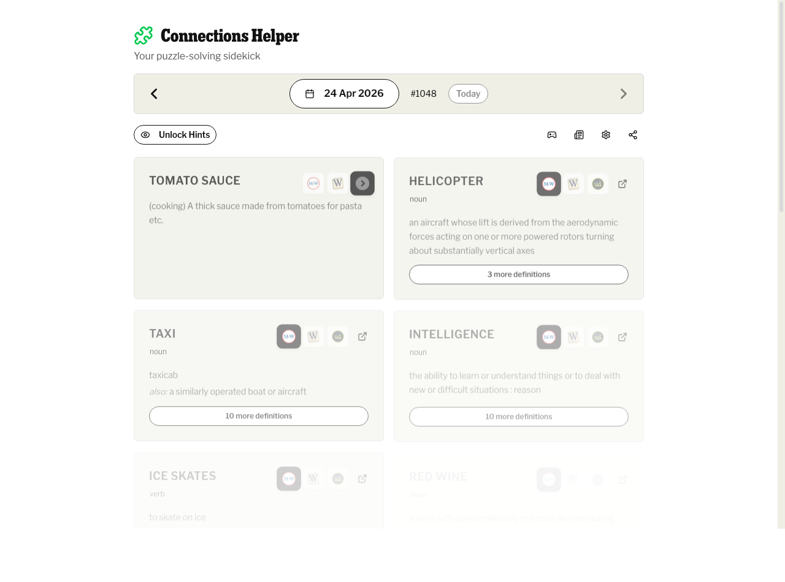

# Connections Helper 🧩

Live: **[connectionshelper.app](https://connectionshelper.app)**

A helper for the [NYT Connections](https://www.nytimes.com/games/connections) puzzle. Shows a definition for each of the 16 words so you can look up an unfamiliar term without spoiling the categories.



- Fetches the daily puzzle from the public NYT endpoint
- Definitions from Merriam-Webster, Free Dictionary, Datamuse, Wikipedia, and Urban Dictionary in a fallback waterfall, toggleable per word
- Caches puzzles + definitions to Cloudflare D1 so repeat lookups are instant
- Optional hints and category reveal for when you're stuck
- Date picker to catch up on previous days

## Why I built this

My girlfriend Becca plays Connections every day, and she'd often hit a word she didn't know and have to flick between a dictionary tab and the puzzle. We wanted a single screen with all 16 words and their definitions side by side. Later I added a hints mode for when you're stuck and a source toggle, because different dictionaries are good at different kinds of words.

Not affiliated with the New York Times.

## Stack

- [TanStack Start](https://tanstack.com/start): full-stack React with file-based server routes + SSR
- [Cloudflare Workers](https://workers.cloudflare.com) runtime, [D1](https://developers.cloudflare.com/d1/) (SQLite at the edge) for caching
- [Drizzle ORM](https://orm.drizzle.team) for typed D1 access
- [Vite](https://vitejs.dev) + React 19
- [Tailwind CSS 4](https://tailwindcss.com) + Radix UI primitives
- [Sentry](https://sentry.io) + [PostHog](https://posthog.com) for errors & analytics (both optional)

See [TECH_CHOICES.md](./TECH_CHOICES.md) for why each piece of the stack was picked (and what was rejected).

## Local development

```bash
pnpm install
pnpm db:migrate:local   # applies drizzle migrations to local D1
pnpm dev                # Vite + Wrangler dev on http://localhost:3000
```

Server routes under `src/routes/api/*` run inside the local Workers runtime and talk to a local SQLite file that Wrangler provisions at `.wrangler/state/`.

## Deploy (Cloudflare Workers + D1)

One-time setup:

```bash
pnpm wrangler d1 create connections_helper_db
# copy the returned database_id into wrangler.jsonc
pnpm db:migrate:remote
```

Every deploy:

```bash
pnpm deploy   # runs vite build + wrangler deploy
```

Optional: attach a custom domain via the Cloudflare dashboard or API:

```bash
curl -X PUT -H "Authorization: Bearer $CLOUDFLARE_API_TOKEN" \
  "https://api.cloudflare.com/client/v4/accounts/$CLOUDFLARE_ACCOUNT_ID/workers/domains" \
  -H "Content-Type: application/json" \
  -d '{"environment":"production","hostname":"connections-helper.example.com","service":"connections-helper","zone_id":"<zone-id>"}'
```

## Configuration

Runtime D1 binding is declared in `wrangler.jsonc`; no secrets needed for core app.

Observability keys are **injected at runtime**, not built into the bundle. The server exposes them via `GET /api/config`, and the browser fetches that on load before initialising Sentry / PostHog. Keys are public by design (they ship to browsers), but keeping them out of the bundle means operators can rotate without rebuilds and forks don't ship your keys.

| Env var               | Purpose                                                   |
| --------------------- | --------------------------------------------------------- |
| `SENTRY_DSN`          | Sentry project DSN. Empty ⇒ Sentry disabled.              |
| `POSTHOG_PROJECT_KEY` | PostHog `phc_…` project key. Empty ⇒ PostHog disabled.    |
| `POSTHOG_INGEST_HOST` | PostHog ingest host (default `https://eu.i.posthog.com`). |

**Local dev:** create `.dev.vars` (gitignored) with the keys. Wrangler loads it automatically.
**CI deploys:** set as GitHub Actions secrets; the workflow passes them to `wrangler deploy --var`.
**Manual deploys:** edit the `vars` block in `wrangler.jsonc`, or pass `--var KEY:value` at deploy time.

See [ARCHITECTURE.md](./ARCHITECTURE.md) for the full runtime-config flow.

## Continuous deployment

`.github/workflows/ci.yml` runs on every push/PR: `pnpm install → lint → build → test`. On green, the `deploy` job (push to `main` only) applies pending D1 migrations and runs `wrangler deploy`, pulling observability keys from repo secrets.

Required repo secrets:

- `CLOUDFLARE_API_TOKEN`: Workers + D1 permissions
- `CLOUDFLARE_ACCOUNT_ID`
- `SENTRY_DSN`
- `POSTHOG_PROJECT_KEY`

Optional repo variable: `POSTHOG_INGEST_HOST` (defaults to `https://eu.i.posthog.com`).

## Scripts

```bash
pnpm dev                # dev server
pnpm build              # production bundle
pnpm deploy             # build + wrangler deploy
pnpm lint               # ESLint
pnpm format             # prettier --check
pnpm check              # prettier --write + eslint --fix
pnpm test               # Vitest unit tests
pnpm test:e2e           # Playwright e2e tests (needs app running)
pnpm loadtest:smoke     # 5 VUs / 35s sanity check against localhost (needs k6)
pnpm loadtest:local     # 100 VUs / 2min against localhost (needs dev server up)
pnpm loadtest:prod      # 100 VUs / 2min against connectionshelper.app
pnpm quality            # format + lint + build + test (what CI runs)
pnpm db:generate        # emit drizzle migrations from schema changes
pnpm db:migrate:local   # apply migrations to local D1
pnpm db:migrate:remote  # apply migrations to remote D1
```

## Load testing

Ad-hoc load tests live in `scripts/loadtest.js` and run via [k6](https://k6.io). Install once with `brew install k6`.

```bash
pnpm loadtest:smoke    # quick 5 VU / 35s sanity check
pnpm loadtest:local    # 100 VU / 2min against localhost (run pnpm dev in another terminal)
pnpm loadtest:prod     # 100 VU / 2min against connectionshelper.app
pnpm loadtest:burst    # 200 VU / 50s, useful before high-traffic days
```

Traffic mix is weighted to roughly match real sessions: 10% `/api/stats`, 30% `/api/puzzle/:date`, 40% `/api/definition/:word`, 20% `POST /api/definitions`. Thresholds enforce p95 latency budgets per endpoint and a sub-2% overall failure rate; the run exits non-zero if any threshold breaks.

`/api/definition/*` and `/api/definitions` are rate-limited per IP via the `API_RATE_LIMIT` Workers binding, and miniflare enforces it locally too. To measure raw throughput on `pnpm loadtest:local`, set `RATE_LIMIT_BYPASS=1` in `.dev.vars`. Without that, even local runs will see ~50% 429s from one egress IP. The script tracks `rate_limited` as a separate metric so a high 429 rate is visible without inflating the failure count. To stress prod headroom past the limiter, run from multiple egress IPs (k6 Cloud, GitHub Actions matrix, or simply two laptops on different networks).

A summary (request count, failure rate, rate-limited rate, p50/p95/p99) prints to stdout; the full per-tag breakdown lands in `loadtest-summary.json` next to the script.

## License

[MIT](./LICENSE)
